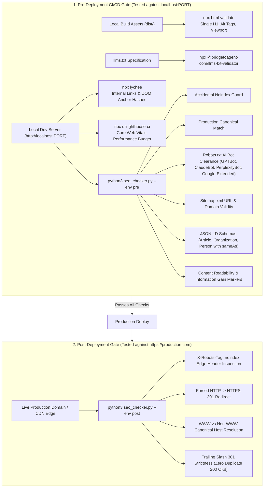

# makelib-seo

[](#local-development--quality-gates)
[](https://www.python.org/)
[](LICENSE)

A drop-in Makefile library and CLI toolkit for CI/CD pipelines that enforces **Technical SEO**, **AI-Search Readiness (GEO - Generative Engine Optimization)**, and **Core Web Vitals** across pre- and post-deployment environments.

---

## Architecture & Pipeline Lifecycle



---

## Detailed Check Reference

### 1. Pre-Deployment (Tested against `http://localhost:PORT`)

#### A. HTML & Meta Tag Integrity
- **Title Tag**: Enforces that `<title>` exists and is between 30 and 60 characters.
- **Meta Description**: Validates `<meta name="description">` exists and is between 120 and 160 characters.
- **Heading Structure**: Enforces exactly one `<h1>` per page. Ensures headings do not skip levels (e.g., `<h2>` must not jump directly to `<h4>`).
- **Mobile Viewport**: Requires `<meta name="viewport" content="width=device-width, initial-scale=1">`.
- **Accessibility & Media**: Requires `<html lang="...">` declaration and `alt` attributes on all `` elements.

#### B. Internal Link & Asset Health
- **Broken Links**: Crawls the local server with `lychee` to ensure no internal `<a href="...">` returns a 404 or 500 error.
- **Anchor Hashes**: Asserts that internal links pointing to `#section-ids` resolve to actual DOM IDs present in the document.

#### C. Application-Level SEO Guards (`seo_checker.py --env pre`)
- **Accidental Noindex**: Fails build if `<meta name="robots" content="noindex">` exists in `<head>`, preventing staging rules from leaking to production.
- **Canonical URL Generation**: Extracts `<link rel="canonical" href="...">` from DOM and asserts the href string matches `--prod-domain`.
- **Sitemap Validity**: Fetches `/sitemap.xml`, parses XML, and ensures all `<loc>` entries use the production domain prefix.
- **Robots.txt AI Bot Clearance**: Fetches `/robots.txt` and asserts that `GPTBot`, `ClaudeBot`, `PerplexityBot`, and `Google-Extended` do **NOT** have `Disallow` rules blocking crawling.

#### D. E-E-A-T & GEO Content Validation
- **Schema.org JSON-LD**: Parses `<script type="application/ld+json">` blocks. Asserts the presence of `Article`, `Organization`, and `Person` types. Enforces that `Person` includes a `sameAs` array populated with social proof URLs (LinkedIn, X/Twitter).
- **Information Gain / Experience Markers**: Scans paragraph text for first-person experience patterns (`r'\b(I tested|we tested|in my experience|our data|my analysis)\b'`). Warns if 0 matches are detected.
- **Readability Scoring**: Uses `textstat.flesch_reading_ease()` to score paragraph text, warning if score is below 40.
- **LLMs.txt Syntax**: Validates `./llms.txt` with `@bridgetoagent-com/llms-txt-validator` according to the standard `llmstxt.org` reference spec.

---

### 2. Post-Deployment (Tested against `https://production.com`)

Focuses purely on live edge network, CDN, and DNS configurations:

#### A. Edge Routing & HTTP Enforcement (`seo_checker.py --env post`)
- **HTTP to HTTPS Redirect**: Forces an unencrypted `http://` request and asserts a 301 Permanent Redirect to `https://`.
- **WWW vs Non-WWW Resolution**: Requests non-preferred host (e.g. `https://example.com` if `www` is preferred) and asserts a 301 redirect to canonical host.
- **Trailing Slash Enforcement**: Requests inverted trailing slash (e.g. `/pricing/` when `/pricing` is canonical) and asserts a 301 redirect, ensuring zero duplicate 200 OK responses exist at the CDN edge.

#### B. Edge Header Guards
- **X-Robots-Tag Inspection**: Inspects live response headers to ensure the CDN/origin is not injecting `X-Robots-Tag: noindex`.

---

## Downstream Integration Guide

To add `makelib-seo` to an existing web project (Next.js, Vite, Astro, Hugo, or static HTML):

### 1. Paste the Downstream Bootstrap Snippet into your `Makefile`

```makefile
# ==============================================================================
# makelib-seo: Downstream Makefile Integration Template
# ==============================================================================
MAKELIB_SEO_REPO ?= https://github.com/sudo-krish/makelib-seo.git
MAKELIB_SEO_DIR  ?= .makelib-seo
MAKELIB_SEO_REF  ?= main

# Project Configuration Overrides
DEV_URL           ?= http://localhost:3000
PROD_DOMAIN       ?= https://example.com
BUILD_DIR         ?= dist

.PHONY: init-makelib-seo update-makelib-seo

$(MAKELIB_SEO_DIR):
	@echo "==> Cloning makelib-seo ($(MAKELIB_SEO_REF)) into $(MAKELIB_SEO_DIR)..."
	@git clone --depth 1 --branch $(MAKELIB_SEO_REF) $(MAKELIB_SEO_REPO) $(MAKELIB_SEO_DIR)

init-makelib-seo: $(MAKELIB_SEO_DIR) ## Bootstrap makelib-seo toolchain
	@echo "==> makelib-seo initialized. Run 'make help-seo' to inspect targets."

update-makelib-seo: $(MAKELIB_SEO_DIR) ## Fetch latest changes
	@cd $(MAKELIB_SEO_DIR) && git fetch origin $(MAKELIB_SEO_REF) && git checkout $(MAKELIB_SEO_REF) && git pull origin $(MAKELIB_SEO_REF)

-include $(MAKELIB_SEO_DIR)/core.mk

ifeq ($(wildcard $(MAKELIB_SEO_DIR)/core.mk),)
help-seo:
	@echo "makelib-seo is not initialized. Run 'make init-makelib-seo' first."
endif
```

### 2. Initialize and Run in CI/CD

```bash
# Initialize makelib-seo in your repository
make init-makelib-seo

# Pre-deployment verification (runs locally against dev server)
make test-pre DEV_URL=http://localhost:3000 PROD_DOMAIN=https://example.com

# Post-deployment verification (runs after production cutover)
make test-post PROD_DOMAIN=https://example.com
```

---

## GitHub Actions CI/CD Example

```yaml
name: SEO & GEO Quality Pipeline

on:
  pull_request:
    branches: [main]
  push:
    branches: [main]

jobs:
  seo-pre-deploy:
    name: Pre-Deployment SEO Gate
    runs-on: ubuntu-latest
    steps:
      - uses: actions/checkout@v4

      - name: Set up Python & Node
        uses: actions/setup-python@v5
        with:
          python-version: "3.12"
      - uses: actions/setup-node@v4
        with:
          node-version: "20"

      - name: Build Web Application
        run: npm ci && npm run build

      - name: Start Local Preview Server
        run: |
          npm run preview -- --port 3000 &
          npx wait-on http://localhost:3000

      - name: Bootstrap makelib-seo
        run: make init-makelib-seo

      - name: Run Pre-Deployment Quality Gates
        run: make test-pre DEV_URL=http://localhost:3000 PROD_DOMAIN=https://example.com

  seo-post-deploy:
    name: Post-Deployment Edge Gate
    needs: [seo-pre-deploy]
    if: github.ref == 'refs/heads/main' && github.event_name == 'push'
    runs-on: ubuntu-latest
    steps:
      - uses: actions/checkout@v4

      - name: Set up Python
        uses: actions/setup-python@v5
        with:
          python-version: "3.12"

      - name: Bootstrap makelib-seo
        run: make init-makelib-seo

      - name: Run Live Edge Routing & CDN Checks
        run: make test-post PROD_DOMAIN=https://example.com
```

---

## Local Development & Quality Gates

`makelib-seo` incorporates repository-level code health and security gates powered by `makelib-py`:

```bash
# Run code formatter (Ruff)
make format

# Run linter (Ruff)
make lint

# Run strict static type checking (Mypy)
make type-check

# Run code smell & AST security scanner (Bandit + McCabe)
make smell

# Run dependency vulnerability audit (pip-audit)
make audit

# Run secret scanning (detect-secrets)
make secret-scan

# Run unit tests with >= 80% coverage gate (Pytest)
make test

# Run all quality gates simultaneously
make check-all
```

---

## License

Licensed under the [Apache License, Version 2.0](LICENSE).
